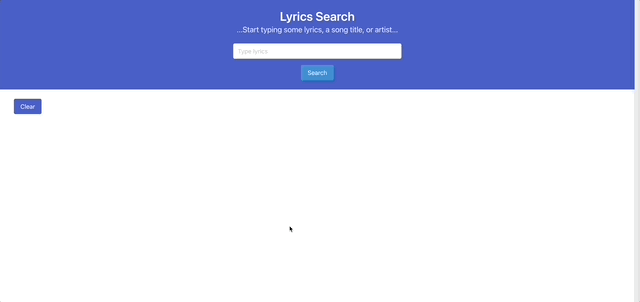
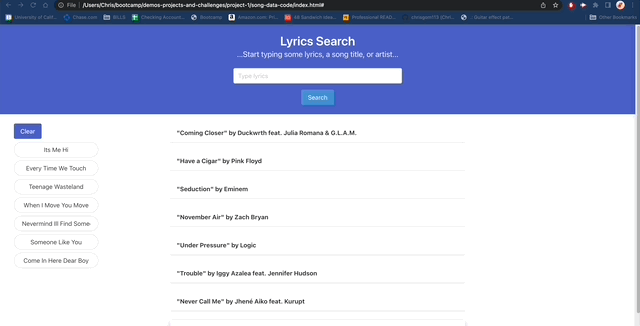

# Lyrics Search Project (w/GIF!)

```
Live URL: https://chrisgom113.github.io/song-data-code/
```

## Description
```
This web app allows users to type in lyric fragments (song titles, artists, etc.) and have a list of songs appear that contain those lyrics. When the user selects one of the results, a modal appears that includes a GIPHY search to pull related GIFs tied to the song title selected.
Often times, people are stuck wondering what song these lyrics they remember or hear are from. This app intends to resolve this problem
```


## User Story 

```
AS a music lover with an average memory.
I want to be able to search lyrics and see results appear with songs that have those lyrics.
SO that I can see the song I’m looking for and plus a related GIF for a nice laugh.
```

## Usage & Mock-Up

```
When user navigates to web page, they are presented with an empty text input and a search button. After entering lyrics, fragments
of lyrics, fragments of song titles and/or artists, they can click the search button and see results appear while also seeing 
the query stored in a history column to the left side. User may click on each individual result to see the name of the album that
contains the song results they clicked, along with a fun GIF file related to the song, artist, or literal text.
```

The following GIF shows the web application's appearance and main functionality:





User will also find that after the page is refreshed, the recent search queries are saved. In addition, they may click each query 
to see that same list of results appear again. 




## Credits

- Collaborators - To bring this to life, this project required the keen and deft skillsets of:
    - Jonathan Robinson (https://github.com/UserHAL-9000)
    - Andre Mays (https://github.com/Dre0239)
    - Christopher Gomez (https://github.com/chrisgom113)

